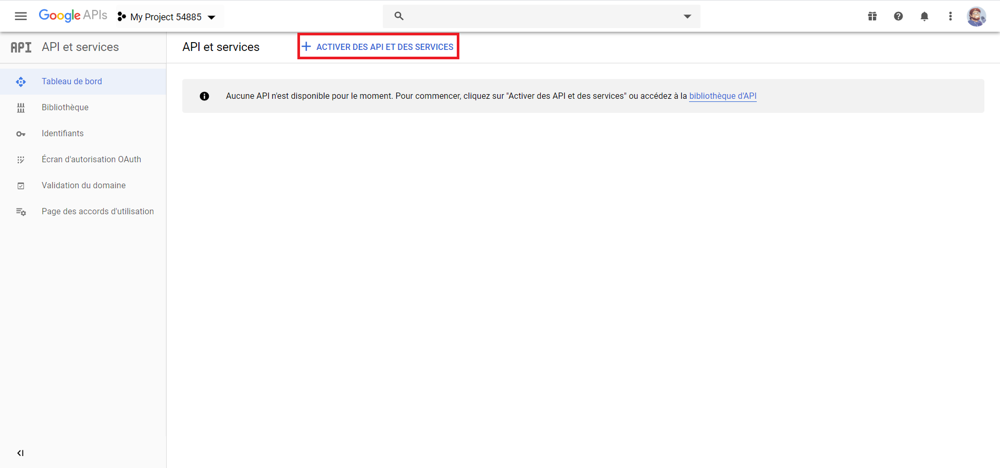
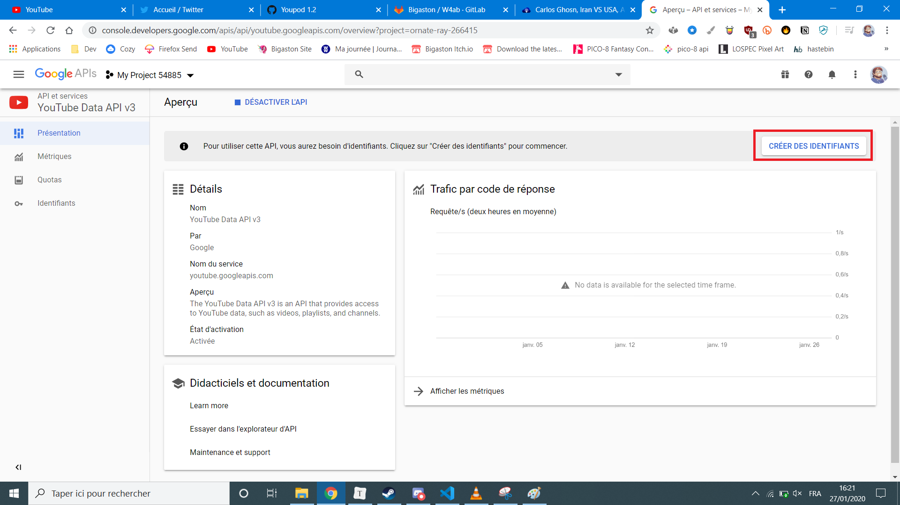
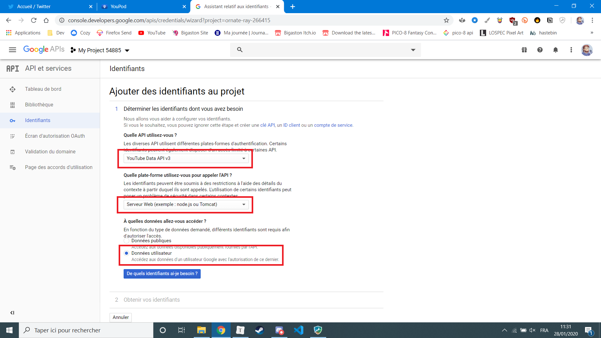

# Récupérer des tokens d'accès Youtube

Pour utiliser l'API Youtube de Youpod il vous faudra un nom de domaine personalisé et un compte Google. Commencez par vous rendre sur [https://console.developers.google.com/apis/](https://console.developers.google.com/apis/).

En haut, créez un nouveau projet et appelez le comme vous voulez.

De retour sur le dashboard, cliquez sur le gros bouton **Activer des API et des services**

Recherchez Youtube et sélectionnez **YouTube Data API v3**. C'est elle qui nous permettra d'ajouter des vidéos à Youtube. Ensuite, cliquez sur le bouton **Activer**.

C'est génial! Vous avez activé l'API. Il faut maintenant aller récupérer les informations de connections. On va cliquer sur le gros bouton **Créer des identifiants**.

Sélectionnez l'API **YouTube Data API v3** pour le type de l'API, et **Serveur Web** comme plateforme qui appellera l'API. Et enfin choisissez les **Données utilisateur** au niveau des données auxquelles vous souhaitez accéder.

Maintenant Google vous demande de configurer l'écran d'autorisation OAuth, pour que les gens puissent se connecter, acceptez la création en cliquant sur **Configurer l'écran d'autorisation**.

Google vous ouvrira donc un nouvel onglet. Ici c'est le moment de choisir **Externe** comme type d'utilisateur. Cela vous permettra de laisser des gens se connecter à votre application.

Maintenant entrez le nom de votre application, et une image. Dans la partie **Champs d'application pour les API Google** ajoutez un champ d'application, et choisissez le scope `/auth/youtube.upload`. Google va râler comme quoi c'est un champ sensible, c'est normal. En dessous ajoutez les différents liens vers vos pages. Vous pouvez utiliser la page [confidentialité](./confidentialite) comme exemple.

Une fois fait, retourné sur l'écran **Identifiants** et cliquez sur **Créer des identifiants**. Choisissez **ID Client OAuth**. Choisissez **Application Web**, donnez lui un nom. Comme origine JavaScript autorisée, entrez votre nom de domaine. Vous pouvez aussi mettre `http://localhost:5674` si vous voulez tester le système en local. Les URI de redirection, mettez aussi vos différents domaines, suivit de `/yt/return`. C'est sur ce chemin que Youpod traitera la requête.

Enfin retournez sur l'écran **Identifiants**. Au niveau de votre identifiant, cliquez sur le petit stylo, et vous aurez accès à vos identifiants à droite, au niveau de **ID Client** et de **Code secret du client**. Identifiants que vous n'aurez plus que à coller dans votre dashboard admin de Youpod!